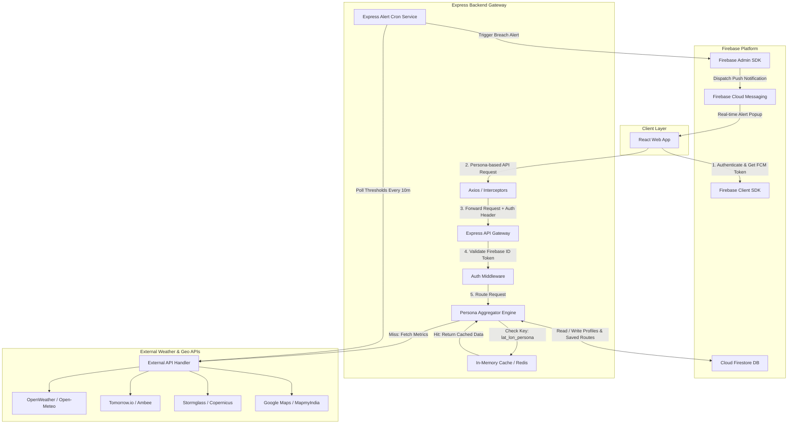

# Comprehensive System Architecture & Technical Specifications

---

## System Overview

This application delivers a persona-driven weather aggregation platform utilizing Node.js, Express, Firebase Firestore, and Redis caching. It dynamically fetches base weather metrics alongside persona-specific data (e.g., AQI for health-conscious users, marine conditions for surfers, or soil moisture for gardeners) and serves them efficiently through an API gateway.

---

## Architectural Flowchart (Mermaid)



---

## Database ER Diagram (DBML)

```dbml
// Users & Authentication
Table users {
  id varchar [pk]
  fullName varchar
  email varchar
  password varchar
  fcmToken varchar
  activePersona varchar
  units varchar
  createdAt timestamp
  updatedAt timestamp
}

// User Saved Locations
Table saved_locations {
  id varchar [pk]
  owner varchar [ref: > users.id]
  label varchar
  latitude float
  longitude float
  city varchar
  createdAt timestamp
}

// Custom Persona Configurations
Table persona_preferences {
  id varchar [pk]
  user varchar [ref: > users.id]
  persona varchar
  aqiThreshold int
  pollenAlert boolean
  commuteMorning varchar
  commuteEvening varchar
  updatedAt timestamp
}

// Push Notifications & Alerts Log
Table alerts_log {
  id varchar [pk]
  user varchar [ref: > users.id]
  persona varchar
  type varchar
  message text
  severity varchar
  isRead boolean
  createdAt timestamp
}

// API Caching Layer
Table cached_weather {
  id varchar [pk]
  cacheKey varchar
  latitude float
  longitude float
  persona varchar
  weatherData json
  expiresAt timestamp
}

// Traveler Persona Packing Engine
Table packing_checklists {
  id varchar [pk]
  user varchar [ref: > users.id]
  destination varchar
  startDate date
  endDate date
  generatedItems json
  customItems json
  createdAt timestamp
}
```

---

## Core Infrastructure Implementation

### Backend Aggregator (`server.js`)

```javascript
import express from 'express';
import axios from 'axios';
import NodeCache from 'node-cache';
import admin from 'firebase-admin';

const app = express();
app.use(express.json());

// Initialize in-memory cache with 15-minute standard TTL
const cache = new NodeCache({ stdTTL: 900 });

/**
 * Weather Aggregator Endpoint
 * Endpoint: /api/v1/weather/dashboard
 */
app.get('/api/v1/weather/dashboard', async (req, res) => {
  const { lat, lon, persona } = req.query;

  if (!lat || !lon || !persona) {
    return res.status(400).json({ error: 'Missing required parameters: lat, lon, persona' });
  }

  const cacheKey = `weather_${lat}_${lon}_${persona}`;

  // 1. Return cached payload if available
  if (cache.has(cacheKey)) {
    return res.json({ source: 'cache', data: cache.get(cacheKey) });
  }

  try {
    // 2. Fetch base weather data required across all personas
    const baseWeatherPromise = axios.get(
      `https://api.open-meteo.com/v1/forecast?latitude=${lat}&longitude=${lon}&current_weather=true&hourly=temperature_2m,relativehumidity_2m,uv_index`
    );

    let specializedPromise = Promise.resolve(null);

    // 3. Conditionally execute external request according to persona
    switch (persona) {
      case 'health_conscious':
        specializedPromise = axios.get(
          `https://air-quality-api.open-meteo.com/v1/air-quality?latitude=${lat}&longitude=${lon}&hourly=pm10,pm2_5,dust,alder_pollen,birch_pollen`
        );
        break;

      case 'surfer':
        specializedPromise = axios.get(
          `https://marine-api.open-meteo.com/v1/marine?latitude=${lat}&longitude=${lon}&hourly=wave_height,wave_period,ocean_current_velocity`
        );
        break;

      case 'gardener':
        specializedPromise = axios.get(
          `https://api.open-meteo.com/v1/forecast?latitude=${lat}&longitude=${lon}&hourly=soil_temperature_0cm,soil_moisture_0_to_1cm`
        );
        break;

      default:
        break;
    }

    const [baseRes, personaRes] = await Promise.all([
      baseWeatherPromise,
      specializedPromise
    ]);

    const payload = {
      base: baseRes.data,
      personaSpecific: personaRes ? personaRes.data : null,
      timestamp: new Date().toISOString()
    };

    // 4. Store result in cache and yield response
    cache.set(cacheKey, payload);
    return res.json({ source: 'api', data: payload });

  } catch (error) {
    console.error('Aggregator Request Error:', error.message);
    return res.status(500).json({ error: 'Failed to retrieve aggregated weather data.' });
  }
});

const PORT = process.env.PORT || 5000;
app.listen(PORT, () => {
  console.log(`Express Weather Gateway running on port ${PORT}`);
});
```

---

## Database Schema Definitions (Firestore JSON)

### `users` Collection

```json
{
  "uid": "usr_987654321",
  "fullName": "Jane Doe",
  "email": "jane@example.com",
  "fcmToken": "fcm_device_token_xyz123",
  "activePersona": "health_conscious",
  "units": "metric",
  "createdAt": "2026-09-06T10:00:00Z",
  "updatedAt": "2026-09-06T10:00:00Z"
}
```

### `saved_locations` Collection

```json
{
  "id": "loc_123456",
  "owner": "usr_987654321",
  "label": "Home",
  "latitude": 19.0760,
  "longitude": 72.8777,
  "city": "Mumbai",
  "createdAt": "2026-09-06T10:00:00Z"
}
```

### `persona_preferences` Collection

```json
{
  "id": "pref_123456",
  "user": "usr_987654321",
  "persona": "health_conscious",
  "aqiThreshold": 100,
  "pollenAlert": true,
  "commuteMorning": "08:00",
  "commuteEvening": "17:30",
  "updatedAt": "2026-09-06T10:00:00Z"
}
```

### `alerts_log` Collection

```json
{
  "id": "alert_123456",
  "user": "usr_987654321",
  "persona": "health_conscious",
  "type": "HIGH_AQI_WARNING",
  "message": "AQI reached 154 (Unhealthy). Limit outdoor exposure.",
  "severity": "HIGH",
  "isRead": false,
  "createdAt": "2026-09-06T16:00:00Z"
}
```

### `packing_checklists` Collection

```json
{
  "id": "pack_123456",
  "user": "usr_987654321",
  "destination": "London",
  "startDate": "2026-09-10",
  "endDate": "2026-09-15",
  "generatedItems": [
    "Carry a raincoat",
    "Waterproof shoes",
    "Light jacket"
  ],
  "customItems": [
    "Passport",
    "Adapter"
  ],
  "createdAt": "2026-09-06T10:00:00Z"
}
```

---

## Implementation Notes

- **Frontend:** React Web App with Firebase Client SDK.
- **Backend:** Node.js + Express API Gateway.
- **Authentication:** Firebase Authentication / Firebase ID Token validation through Firebase Admin SDK.
- **Database:** Cloud Firestore.
- **Caching:** Redis for production; NodeCache for the initial/local prototype.
- **Notifications:** Firebase Cloud Messaging (FCM).
- **Weather:** Open-Meteo and other specialized weather/environment APIs.
- **External API abstraction:** Keep provider-specific logic behind an External API Handler so providers can be replaced without changing the frontend.
- **Alerts:** Background cron service checks user-defined thresholds and sends FCM notifications.
- **Persona Engine:** Persona determines which specialized metrics and recommendations are fetched and displayed.

## Important Prototype Consideration

For a one-day prototype, the architecture can be simplified:

1. React frontend.
2. Express backend.
3. Firebase Authentication + Firestore.
4. Open-Meteo for weather and air-quality data.
5. NodeCache instead of Redis.
6. FCM can be implemented after the core dashboard is working.
7. Additional APIs such as marine, maps, or travel services can be integrated behind the same abstraction later.

This keeps the architecture scalable while avoiding unnecessary infrastructure during the initial prototype.
